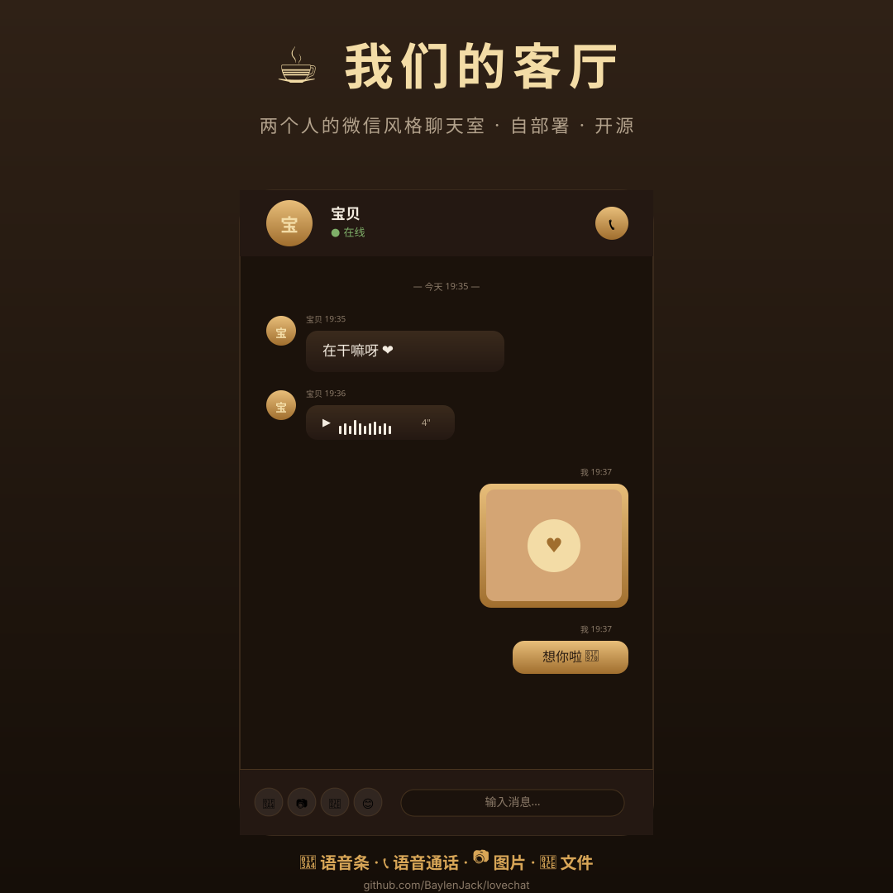

# ☕ 我们的客厅 (LoveChat)

> 一个像微信聊天界面一样的双人实时通信应用 —— 文字、语音条、图片、文件、语音通话。

[](LICENSE)
[](https://nodejs.org)
[](https://webrtc.org)
[](CONTRIBUTING.md)

<p align="center">
  
</p>

## ✨ 这是什么

为异地情侣 / 亲密伙伴设计的**极简双人聊天**：

- 🎨 **微信风格 UI** —— 气泡消息流，输入区在最底部
- 🔑 **房间密码** —— 首个进入者设置密码，之后进入需验证（服务端只存哈希）
- 🖼️ **自定义头像** —— 双方可见，消息 / 顶栏 / 通话 / 动态统一显示
- 🌄 **聊天背景** —— 自定义背景图，仅自己可见
- 🌙 **动态** —— 图文动态 + 点赞，像两个人的朋友圈
- 🎤 **语音条** —— 按住说话、松开发送，上滑取消
- 📞 **语音通话** —— WebRTC 直连 + TURN 中继，穿透 NAT
- 📷 **图片消息** —— 客户端自动压缩（1200px / JPEG 0.82）
- 📎 **文件消息** —— HTTP 上传（不走 WebSocket，速度快 5×）
- 💾 **历史持久化** —— 服务端存消息 + 文件，重连不丢
- 🔌 **断线重连** —— 自动指数退避，凭 token 认领身份

**和微信的区别**：完全自部署、开源、纯 P2P（语音通话）、无中间商、无审查、无云存储。
**和会议软件的区别**：没有视频墙、没有白板、没有参会者列表 —— 就是两个人聊天的样子。

## 🎬 截图

<p align="center">
  
</p>

预览由 SVG 生成 — 显示了文字气泡、语音条、图片消息、输入区、顶栏通话按钮等核心元素。

## 🚀 5 分钟部署

### 1. 克隆并安装

```bash
git clone https://github.com/BaylenJack/lovechat.git
cd lovechat
npm install
npm start
```

服务默认监听 **8080 端口**。浏览器打开 `http://localhost:8080/`，输入昵称和房间名，告诉对方同样的房间名，就能聊天了。

### 2. 公网部署（推荐）

**最简方式 — Cloudflare Tunnel（不需要备案）**

```bash
# 1. 安装 cloudflared（你的电脑或服务器）
# 2. 登录
cloudflared tunnel login
# 3. 创建隧道
cloudflared tunnel create lovechat
# 4. 改 config.yml：
echo "
tunnel: <your-tunnel-id>
credentials-file: <your-tunnel-cred.json>
ingress:
  - hostname: chat.yourdomain.com
    service: http://127.0.0.1:8080
  - service: http_status:404
" > ~/.cloudflared/config.yml
# 5. 加 DNS 路由
cloudflared tunnel route dns lovechat chat.yourdomain.com
# 6. 启动隧道
cloudflared tunnel run lovechat
```

**自购 VPS**（最稳定）：一台 1 核 1GB 内存的轻量服务器够用，推荐**香港 / 日本**机房（延迟 < 100ms）。腾讯云轻量、香港轻量都行。

### 3. 语音通话需要 TURN（穿透 NAT）

手机在 4G/WiFi NAT 后时，P2P 直连会被防火墙拦。要配 TURN 中继：

```bash
# 安装 coturn（Linux）
sudo apt install coturn
# 配置见 deploy/coturn.conf
# 前端在 public/app.js 里改 iceServers 配置
```

## 📁 项目结构

```
lovechat/
├── src/
│   └── server.js          # Node 服务端 — ws + HTTP
├── public/
│   ├── index.html         # 微信风格聊天界面
│   ├── style.css          # 暖金主题样式
│   └── app.js             # 前端逻辑（录音 / WebRTC / 消息收发 / 动态 / 设置）
├── test/
│   └── e2e.mjs            # 端到端测试
├── deploy/
│   ├── systemd.service    # Linux 服务守护
│   └── coturn.conf        # TURN 服务器配置示例
├── docs/plans/            # 设计与实施计划
├── package.json
├── README.md
├── LICENSE
└── CONTRIBUTING.md
```

## ⚙️ 配置

通过环境变量覆盖（全部可选）：

| 变量 | 默认 | 说明 |
|---|---|---|
| `PORT` | `8080` | HTTP/WebSocket 端口 |
| `DATA_FILE` | `data/messages.json` | 消息存档路径 |
| `MAX_UPLOAD` | `10 MB` | 文件上传上限 |

## 🧪 开发与测试

```bash
npm install
npm test          # 跑端到端测试(需要服务先启动)
npm start         # 启动服务
```

测试覆盖：
- ✅ 文字 / 图片 / 文件 / 语音条消息收发
- ✅ 历史持久化与重连
- ✅ 房间密码（设置 / 错误密码拒绝 / 正确进入）
- ✅ 动态（发布 / 点赞 / 取消点赞广播）
- ✅ 头像（变更广播 / 重连带回）
- ✅ WebRTC 信令（offer / answer / ICE）双向转发
- ✅ 通话控制（邀请 / 接听 / 拒绝 / 挂断）
- ✅ 非法输入防护

## 🎨 设计原则

1. **隐私优先** —— 语音走 P2P，消息不经过任何云端（除自部署的服务端）
2. **极简** —— 只有两个人，只有聊天该有的功能，没有花哨
3. **暖色调** —— 配合五子棋项目传承下来的金色主题
4. **离线友好** —— 断网后重连、刷新页面，历史都不丢

## 🛠️ 技术栈

- **后端**：Node 20+, `ws`（WebSocket）, 纯文件持久化（无数据库依赖）
- **前端**：零框架依赖（vanilla JS + Canvas-free UI），原生 WebRTC
- **传输**：WebSocket（消息）+ HTTP/1.1（文件上传下载）
- **音频**：Opus via WebRTC, **P2P 直连优先**，失败时回退 TURN

## 🤝 贡献

欢迎 PR！请先看 [CONTRIBUTING.md](CONTRIBUTING.md)。

特别欢迎：
- 🌐 国际化（i18n）翻译
- 🎨 主题（暗色 / 浅色 / 其它配色）
- 🔧 TURN 服务器自动化部署脚本
- 🐛 Bug 报告

## 📜 协议

[MIT License](LICENSE) — 你可以用它做任何事，包括商用。

## 🙏 致谢

设计灵感来自微信聊天界面。
技术选型参考了 [MiroTalk](https://github.com/miroslavpejic85/mirotalk) 的 WebRTC 架构。
金色主题来自配套的 [五子棋项目](https://github.com/BaylenJack/billiards-game)。

---

<p align="center">
  <sub>用 ❤️ 写给异地的人</sub>
</p>